# Watch Box Web App 
Find a deployed version at: https://rollandbox.co.uk
Please feel free to sign up and create an account.
Hosted on Firebase.

This Project is still Live and I have been getting feedback from users which has been feeding into ongoing changes and upgrades.

## Project outline
This website is mainly aimed at helping the user with two things.
1. Allowing the user to easily store images and information about their watches in order to have a simple and easy to view their watch collection or allowing other so view
2. Allows users to view and comment on other collectors watches. 

This will allow both collectors and sellers to easily show their entire collection in one place.

As users will be interested in using this application while out it has been designed to work on all platforms: mobiles, Ipad and desktop.

## User Actions
- Login / SignUp 
- Add Watches, Delete Watches
- Add Avatar, Change Avatar
- Like watches, Comment on Watches
- View Personal Collection of watches, View Collection of Followed Users watches.

## Additions to come
I am currently working on adding a 'Posts' section for a stream of lifestyle photos taken by the user, acting as a way to show the watches in real life setting, with clothes etc.

## Technologies
This was built on a React cra front end with Tailwind css used for styling and firebase used for the data storage.

- Tailwind Css - Used to style the components, This has been very useful to make the site work easily on all platforms from mobile to desktop. Its also includes responsive interaction and animations for loading screens etc. 
- React-Loading-Skeleton - place holder visual white data is loading, holds space ready for images to load into.
- React-Image-Crop - This has been a very useful package used to upload and crop the images, however making the UI around the cropper was very important to make the interaction easy to follow.
- Eslint - used for managing code base and checking for best code practice.

Hosted on Firebase using Firebase databases and storage to handle information on the page.

## Interesting applications to create box
One of the hardest and most important part of the app has been creating the box to hold Desktop web browsers.
I tried a few different ways starting with a large background image and placing each image over, the other version creates a box around each mobile rendered. the difference is that the rendering of the full box will always show a full box in a full rectangle where are the individual wrapping will have gaps in the were watches have not been uploaded (the empty spaces in the grid will show as empty)

## Profile and TimeLine Watch Box

## Watch Enlarge Modal for Desktop and Mobile Version

## Timeline and Profile layouts for Mobile, Ipad, Desktop Version
<!-- 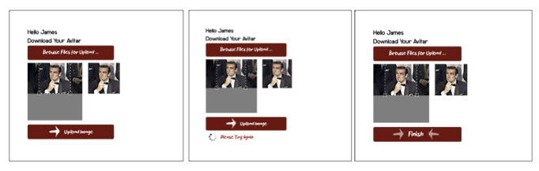 -->
<!-- 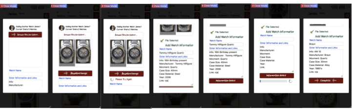 -->
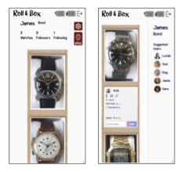
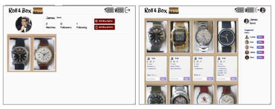
<!-- 
 -->

## Upload New Avatar and Watch Upload Modal for Mobile and Ipad/Desktop Version
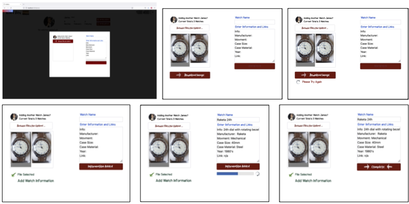
<!--  -->

<!-- 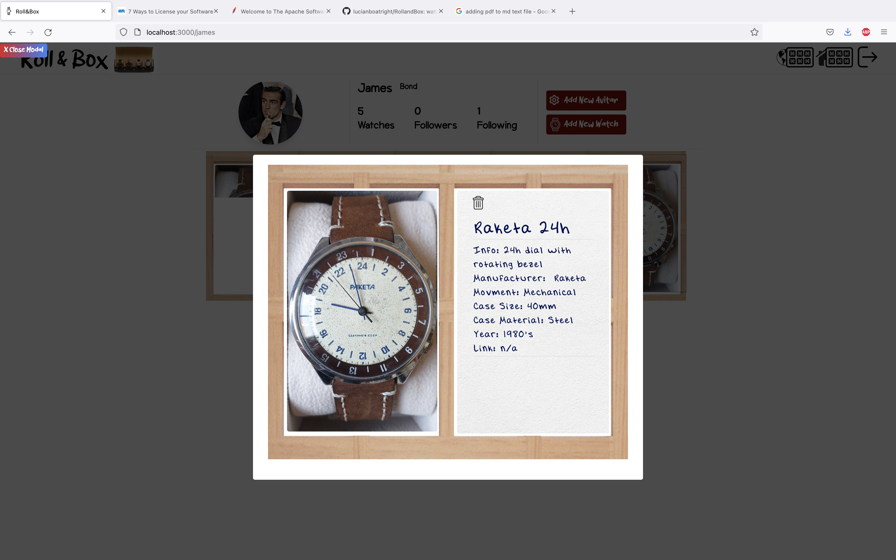

 -->

<!-- ## Upload Avatar Modal
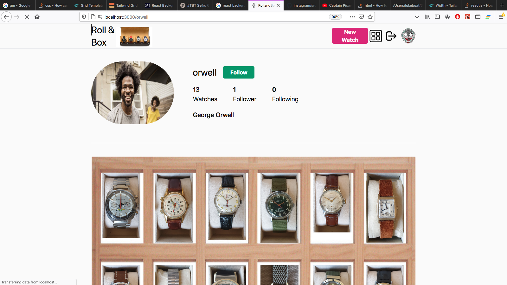

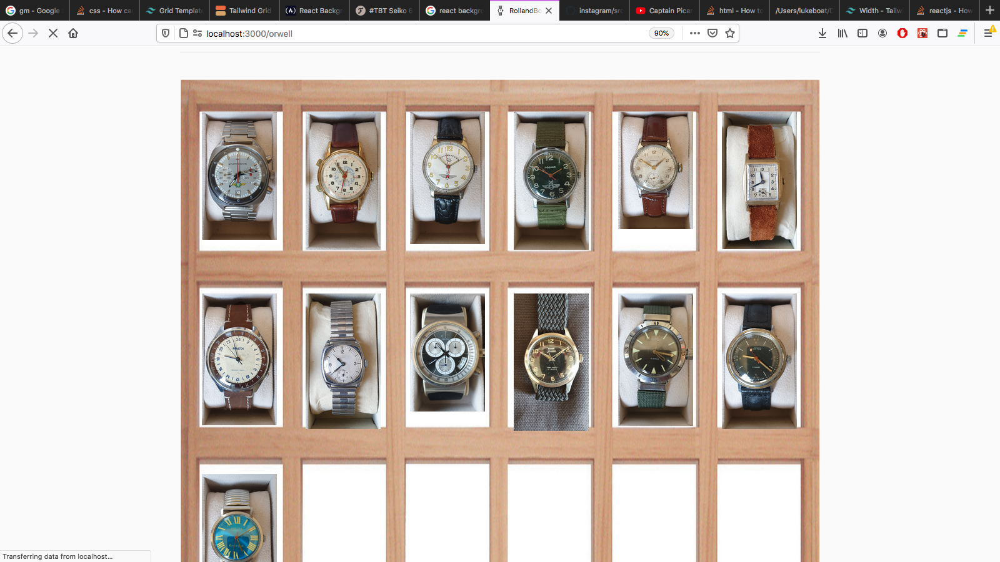

## Empty Profile and Group Collections without Followers
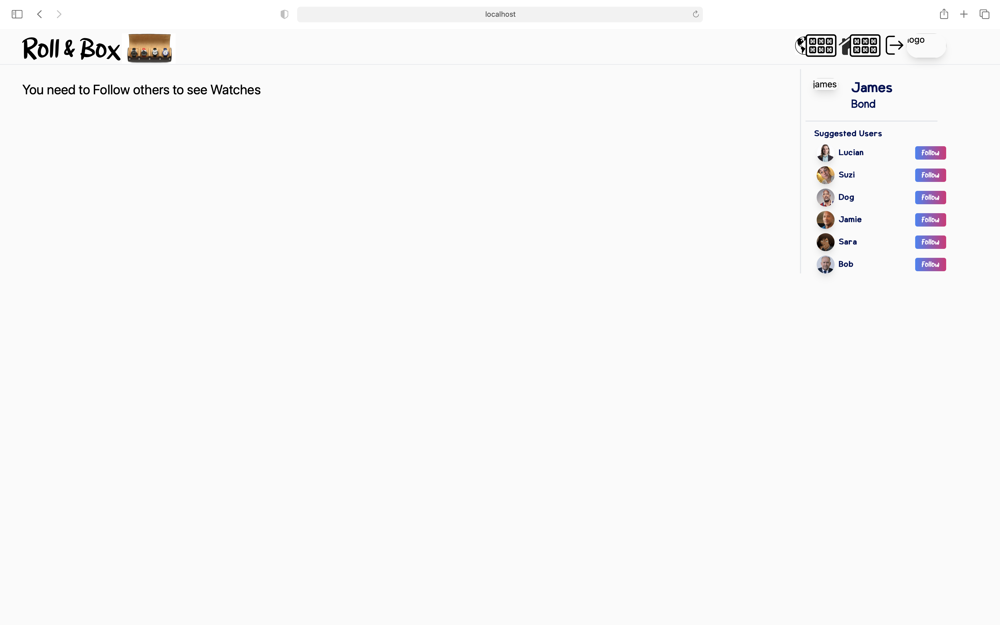
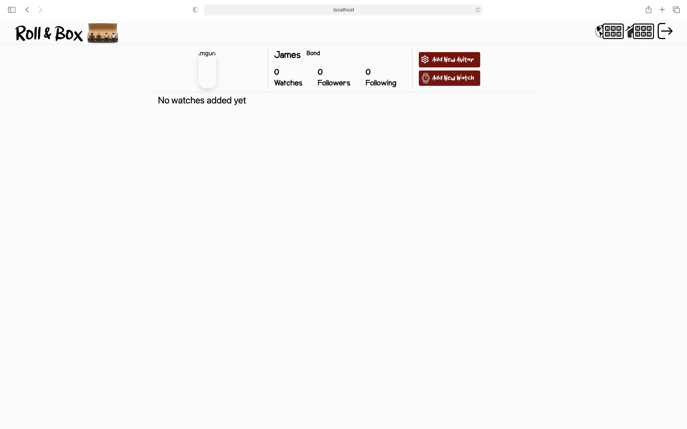 -->

<!-- This had its limitations though it me be something that the user can chose between.
- This style will have empty spaces even if the watch is not there. 
- Works well when there is not information.
The second style uses a single a single box .png as shown below which is used as a background image that is repeated around each image which means the box will only be visiable around existant watches. This means the box is infinate and will grow with the collection. It does also mean that there will be spaces that are not showing the box leading to a non complete box visual as shown below.
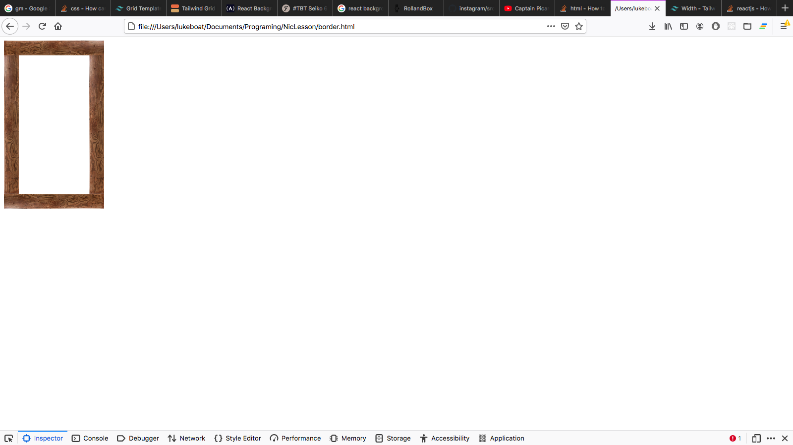
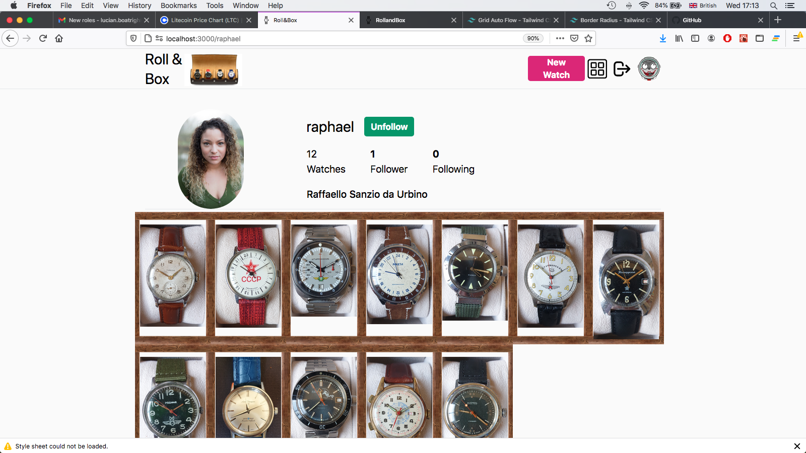
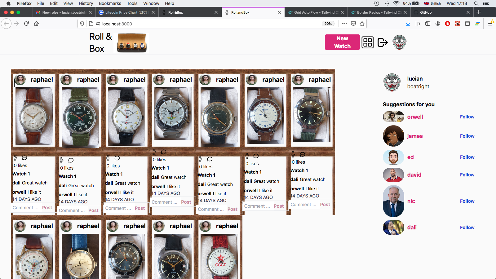 -->
